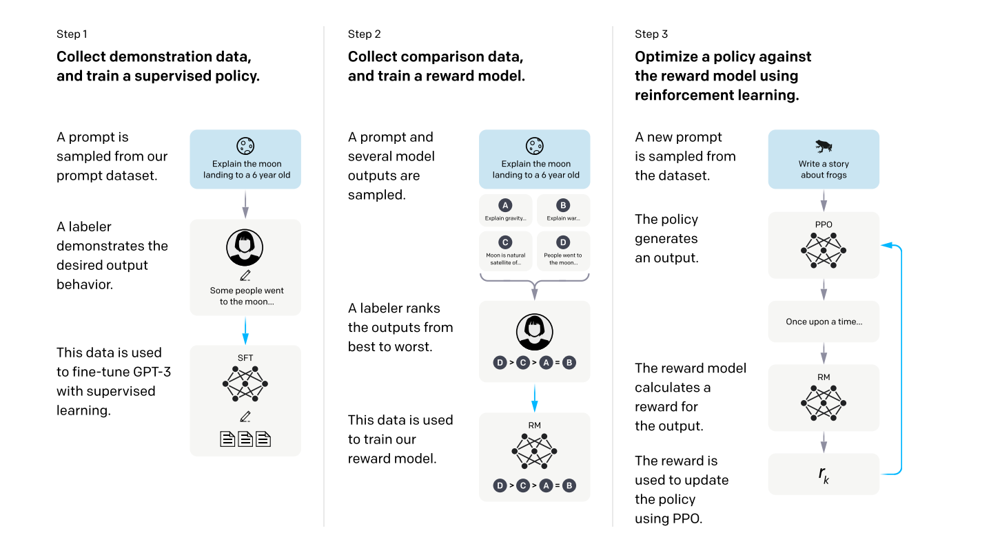

# Introduction

Motivation:

- model越大不是越好,与人类意图不对齐(unalign)

Method：

- fine-tuning with human feedback (RLHF)

Train process:

Result:

- 1.3B+RLHF＞175B  性能不减，输出更真实	

Discussion

- RLHF是一个方向,用于对齐人类意图