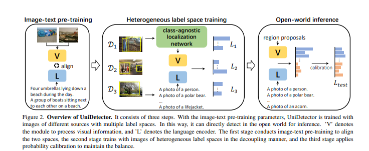
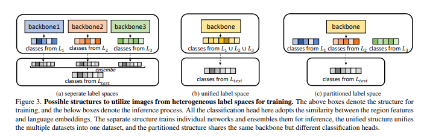
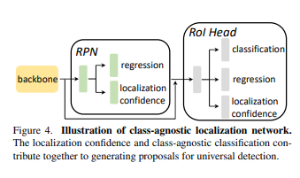

# Do what

- it leverages images of multiple sources and heterogeneous label spaces for training through the alignment of image and text spaces, which guarantees sufficient information for universal representations（多源数据，异质标签空间，多模态对齐）
- it generalizes to the open world easily while keeping the
  balance between seen and unseen classes, thanks to abundant information from both vision and language modalities（多模态信息）
- decoupling training manner and probability calibration（解耦训练方法和概率校准）

# Relative Work：(这里可以看作一个review看)

open-vocabulary OD：

-  "existing methods still target at transferring within a single dataset."
- "their seen categories are usually more than unseen categories.
  Their generalization ability is thus restricted"

Multi-dataset object detection training

- 过去的多数据集训练仅仅关注close-set OD

# How？

- Introduce language embeddings (RegionCLIP ) to assist detection
- Heterogeneous label space training  "we adopt the decoupling manner during the training process instead of the previous joint training"
- Open-world inference："propose probability calibration to keep the inference balanced between base categories and novel categories in this step"

## 多数据集训练

### network structure

separate structure

unified structure

partition structure

### data sampler

### loss

## Decoupling proposal generation and RoI classification

这里分析了两个问题

- 对于universal OD来说，RPN网络是有效的，因为特本身就是class-agnostic的  “can be easily extended to novel classes”

- class-specific RoI classification stage cannot even work for
  novel categories  Even with language embeddings, it is still
  biased to base classes.

- 联合训练，由于ROI分类的局限性会影响类别无关的RPN网络的泛化性（the universality ability of the pro-
  posal generation stage

  

  

### CLN

ref：ahun Kim, Tsung-Yi Lin, Anelia Angelova, In So Kweon,
and Weicheng Kuo. Learning open-world object proposals
without learning to classify. RAL, 2022

## Open world Inference

