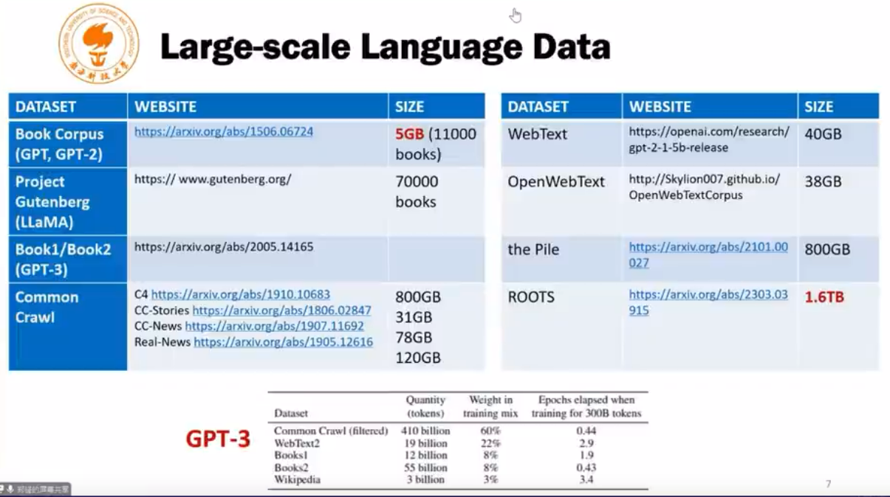
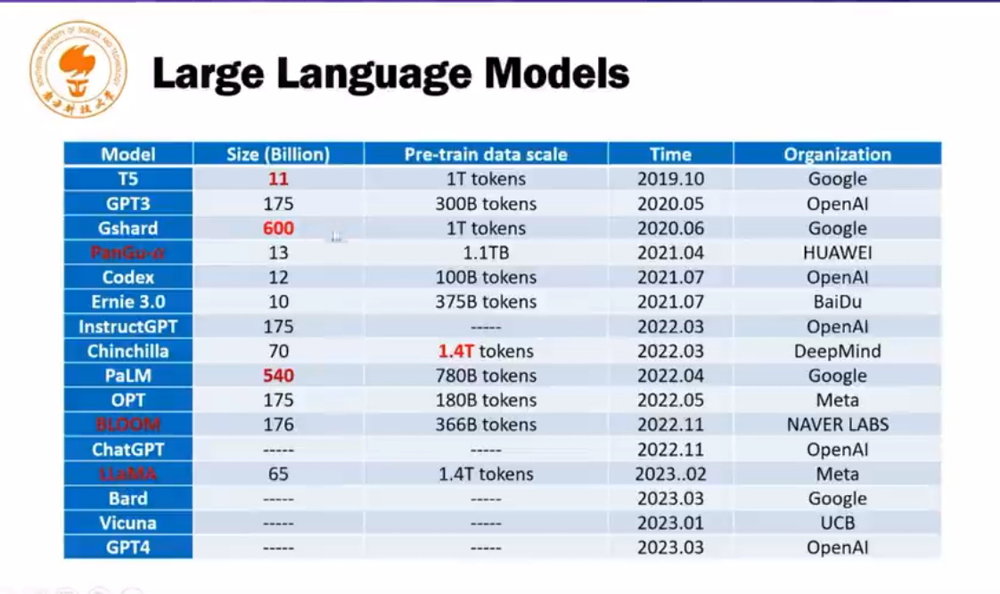
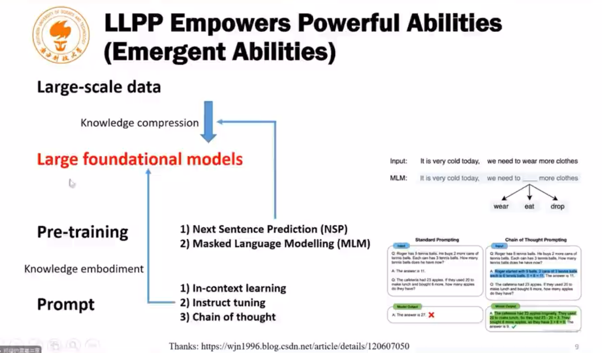
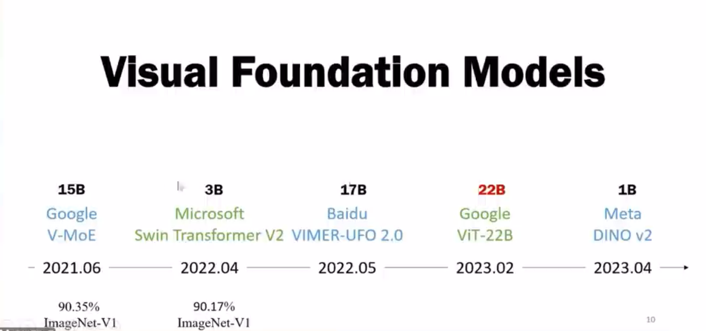
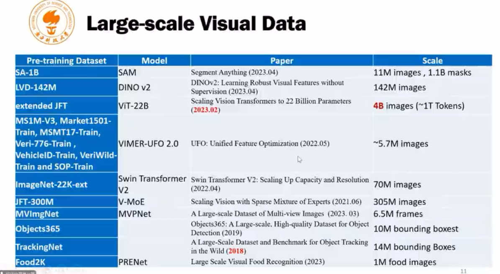
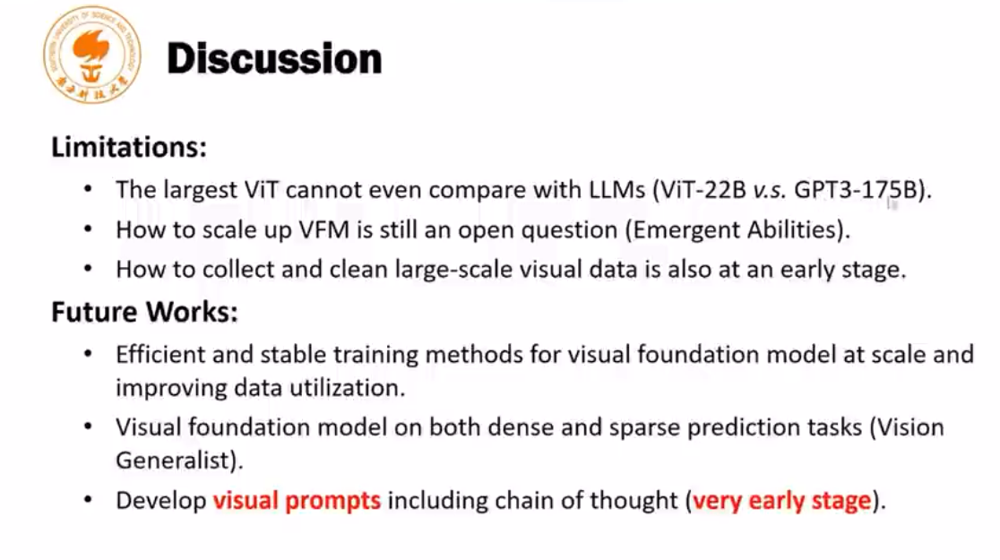
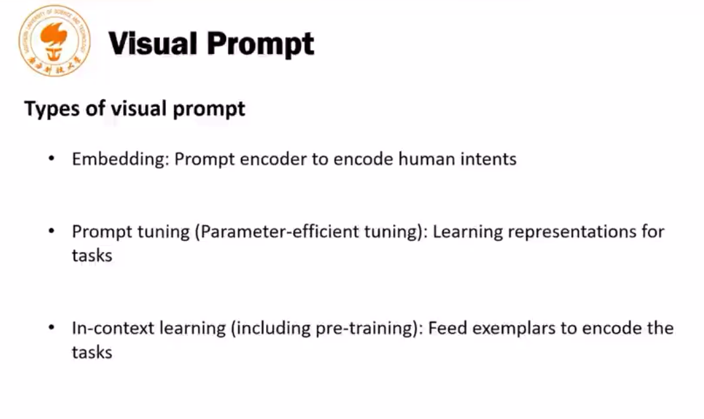

> [20230426【通用大模型时代的计算机视觉研究】郑锋：“Segment Anything”浅谈及应用介绍][https://www.bilibili.com/video/BV17o4y1t7nU/?spm_id_from=333.1007.tianma.1-1-1.click&vd_source=1fc065f050bce8320b3a173f446bbc81]

# 语言大模型：数据大小，模型大小，基本的构建方法

## 数据大小：

## 模型大小

## How to construct a LLM：

- 通过自监督任务压缩知识
- 通过ICL（样例学习），Instruct tuning，Chain of thought(分解子问题)预训练模型

# 视觉大模型：

## 发展历程

## 现有的模型大小和数据量大小

## 讨论视觉局限性：还没有涌现能力

- 模型还不够大
- 如何变大？模型构建，如何训起来这样一个模型
- 如何构建大的数据集

未来的方向：

- 改进大模型的训练方法
- 视觉任务的差异性导致上下游无法统一，如何统一任务？
- 为了提取，大模型从大数据学习到的知识，语言模型中构建了prompt机制。而视觉prompt机制发展尚不完善。

# 视觉prompt的发展

## Emdedding

## PEFT

## In context learning

# SAM的构建以及其应用

> human in the loop，model in the loop

Contribution：

- new task : prompt able segmentation
- New Model: SAM
- New Data engine: SA-1B

